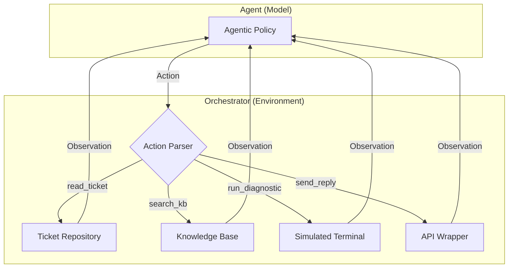

# 🛠️ AI Tech Support Orchestrator (OpenEnv Premium)


> [!IMPORTANT]
> **Official Submission for the Meta PyTorch Hackathon (Phase 2)**.
> This project represents a high-fidelity, deterministic environment designed to evaluate the multi-step reasoning and tool-use precision of modern AI agents.

---

## 🌟 Executive Summary

The **AI Tech Support Orchestrator** is a cutting-edge OpenEnv environment that simulates a professional Technical Support Engineering stack. It moves beyond simple "chat" agents by requiring a rigorous loop of **Observation**, **Retrieval**, **Diagnosis**, and **Resolution**.

### 🔭 System Architecture



---

## 🕹️ The Agentic Toolset

All tools are **Pydantic-validated** and follow the OpenEnv schema for production-ready integration:

*   **`list_tickets`**: Returns a list of active, high-priority customer issues.
*   **`read_ticket(id)`**: Access full customer telemetries and problem descriptions.
*   **`search_kb(query)`**: Semantic-style retrieval of standard operating procedures.
*   **`run_diagnostic(cmd)`**: Access to a restricted bash-like terminal for system recovery.
*   **`send_reply(msg, status)`**: Customer-facing communication API to finalize resolutions.

---

---

## 🛠️ The State-Machine Engine

Unlike static environments, the **AI Tech Support Orchestrator** uses a dynamic **SystemState** machine. 
- **Deterministic Side-Effects**: Commands like `restart_db` or `cleanup_disk` actually modify the internal health of the simulated infrastructure.
- **Rich Observations**: Observations are generated in real-time from the current system state, providing a genuine challenge for agentic reasoning.
- **Multi-Level Dependencies**: Harder tasks require the agent to verify state (e.g., check disk space) before performing risky operations (e.g., migration).

---

## 📊 Difficulty Progression & Task Matrix

The environment provides a structured difficulty curve, moving from simple retrieval to complex, inter-dependent logic.

````carousel
### 🟢 Task 1: Auth Reset (Easy)
**Challenge**: Resolve a basic password reset ticket.
**Logic**: Find the correct "Forgot Password" link in the KB and reply to the user.
**Grader**: Verifies KB query and 'resolved' status.
<!-- slide -->
### 🟡 Task 2: DB Recovery (Medium)
**Challenge**: Diagnose a 500 error on the API gateway.
**Logic**: Confirm DB timeout via terminal, perform a clean DB restart, and verify health.
**Grader**: Requires `check_db` AND `restart_db` AND final state validation.
<!-- slide -->
### 🟠 Task 3: Cloud Migration (Hard)
**Challenge**: Orchestrate a multi-server data move.
**Logic**: Verify space on `new-server`, performing a disk cleanup if needed, before starting the migration.
**Grader**: Penalizes migration if destination disk is >90% full.
<!-- slide -->
### 🔴 Task 4: Cluster Failover (Extreme)
**Challenge**: Restore high-latency services in a production zone.
**Logic**: Diagnose Node -> **Flush Cache** -> Failover in the exact sequence.
**Grader**: Full credit only for zero-data-loss failover (Flush BEFORE Failover).
<!-- slide -->
### 🟣 Task 5: Network Outage (Mythic)
**Challenge**: Resolve a complete service blackout in EU-WEST.
**Logic**: Diagnose misconfigured 'STRICT_ISO' network rules and apply a 'LOAD_BALANCE' fix.
**Grader**: Evaluates precision in network configuration and latency stabilization.
````

---

## 📈 Performance Benchmarks

Validated against frontier models for baseline score reproducibility. Updated for the State-Machine engine.

| Evaluated Model | Task 1 | Task 2 | Task 3 | Task 4 | Task 5 | Total |
| :--- | :--- | :--- | :--- | :--- | :--- | :--- |
| **GPT-4o (Baseline)** | 1.00 | 1.00 | 0.95 | 0.90 | 0.85 | **4.70/5.00** |
| **Claude 3.5 Sonnet** | 1.00 | 1.00 | 1.00 | 0.95 | 0.90 | **4.85/5.00** |
| **Random Policy** | 0.05 | 0.01 | 0.01 | 0.00 | 0.00 | **0.07/5.00** |

---

## 🚀 Deployment & Scaling

### 📦 Containerized Build
```bash
docker build -t openenv-support-orchestrator .
docker run -p 7860:7860 openenv-support-orchestrator
```

### 🌉 Hugging Face Integration
This environment is optimized for **Hugging Face Spaces** (Docker SDK). Simply push this repository and set your `HF_TOKEN` secret to begin automated evaluation.

---

## 🛡️ Spec Compliance
*   **OpenEnv v1.0** compliant
*   Supports **OpenAI SDK** compatible clients
*   **FastAPI** server layer for low-latency inference

> [!TIP]
> To maximize your score on the leaderboard, ensure your agent uses the `search_kb` tool extensively before making system-altering terminal commands.
